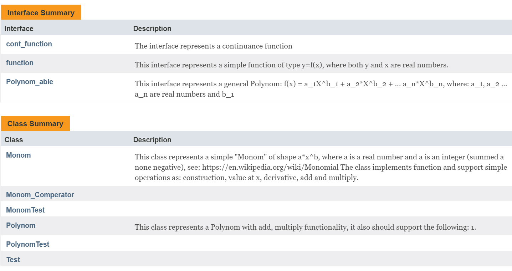

<h1>Polynom</h1>
Created during an object-oriented programming course at Ariel University 2018.
<h3>Project site: <a href="https://zvimints.github.io/Polynom/">https://zvimints.github.io/Polynom/</a></h3>
<h3>Welcome to my and <a href="https://github.com/orabu103">Or Abuhazira</a> Project</h3>
<h3>About the program</h3>
The purpose of the program is to represent a polynomial by elementary actions between monom's,
using this program you can perform multiplication, addition, subtraction, derivative,
integral calculation and finding zero point between polynomials, and more.
In particular, it is possible to perform identical elementary actions in a monom, 
in addition you can draw the polynomial function on the graph and display Max and Min points of the input function.
<h3>The Project Includes:</h3>

<h3>Package myMath:</h3>

<h3>Hierarchy of myMath</h3>

<h3>Monom class</h3>

<h3>Constructors:</h3>

<h3>A valid init for Monom:</h3>
<list>
<li>From other Monom</li>
<li>From coefficient and power</li>
<li>From string of the form:</li>

</list>
<h3>Polynom class</h3>

<h3>Constructors:</h3>

<h3>A valid init for Polynom:</h3>
<list>
<li>From String which consists of addition and subtraction operations between valid monoms</li>
<li>From other Polynom</li>
</list>
<h3>Graph</h3>

<h4>Package Graph</h4>

<h3>About the Graph</h3>
The graph is an open source library which can be found at <a href="https://github.com/rendon/Plane">https://github.com/rendon/Plane</a>
The graph has been modified in visibility and now shows minimum and maximum points on the function
 

 
The yellow dots represents the minimum and maximum points of the function (the function in Cyan color )
<h3>Unit Testing</h3>

Under the Polynom\OOP Assignment\Testing\myMath folder you can find two Unit Testing files in order to test MONOM class and POLYNOM class that can be found at myMath package
<h3>External info</h3>

<list>
<li>Riemann's Integral: <a href="https://en.wikipedia.org/wiki/Riemann_integral">https://en.wikipedia.org/wiki/Riemann_integral</a></li>
<li>Root: <a href="https://www.geeksforgeeks.org/program-for-bisection-method/"> https://www.geeksforgeeks.org/program-for-bisection-method/</a></li>
<li>Polynomial: <a href="https://en.wikipedia.org/wiki/Polynomial">https://en.wikipedia.org/wiki/Polynomial</a></li>
<li>Monomial: <a href="https://en.wikipedia.org/wiki/Monomial">https://en.wikipedia.org/wiki/Monomial</a></li>
<li>Derivative: <a href="https://en.wikipedia.org/wiki/Derivative">https://en.wikipedia.org/wiki/Derivative</a></li>
</list>

