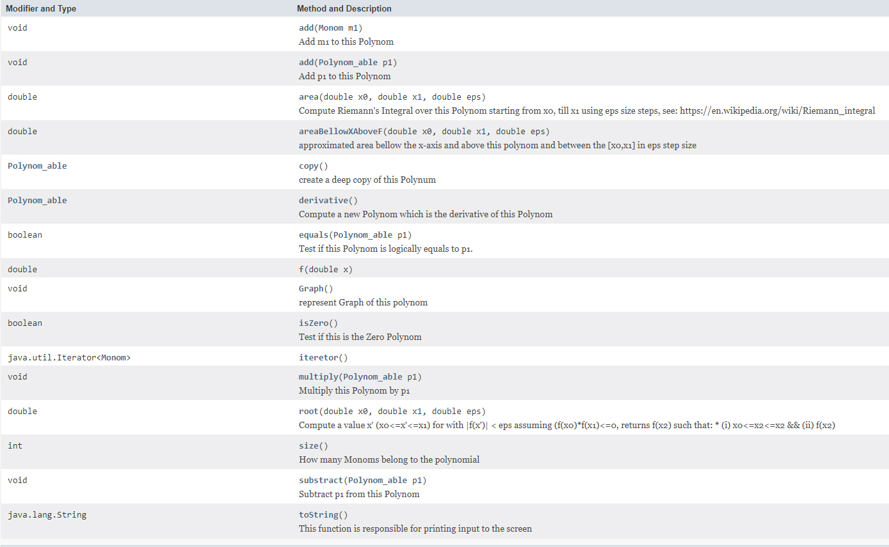

Created during an object-oriented programming course at Ariel University 2018.
<h3>Project site: <a href="https://zvimints.github.io/Polynom/">https://zvimints.github.io/Polynom/</a></h3>
<h1>Welcome to my and <a href="https://github.com/orabu103">Or Abuhazira</a> Project</h1>
<h3>Hierarchy of the program</h3>

<h3>The Program includes:</h3>

<h3>About the program</h3>
The purpose of the program is to represent a polynomial by elementary actions between monomers,
using this program you can perform multiplication, addition, subtraction, derivative,
integral calculation and finding zero point between polynomials, and more.
In particular, it is possible to perform identical elementary actions in a monom, 
in addition you can draw the polynomial on the graph and display Max and Min points
<h3>Monom class</h3>

<h3>Constructors:</h3>

<h3>A valid init for Monom:</h3>
<list>
<li>From other Monom</li>
<li>From coefficient and power</li>
<li>From string of the form:</li>

</list>
<h3>Polynom class</h3>

<h3>Constructors:</h3>

<h3>A valid init for Polynom:</h3>
<list>
<li>From String </li>
<li>From other Polynom</li>
</list>
<h3>External info</h3>
<list>
<li>Riemann's Integral: <a href="https://en.wikipedia.org/wiki/Riemann_integral">https://en.wikipedia.org/wiki/Riemann_integral</a></li>
<li>Root: <a href="https://www.geeksforgeeks.org/program-for-bisection-method/"> https://www.geeksforgeeks.org/program-for-bisection-method/</a></li>
<li>Polynomial: <a href="https://en.wikipedia.org/wiki/Polynomial">https://en.wikipedia.org/wiki/Polynomial</a></li>
<li>Monomial: <a href="https://en.wikipedia.org/wiki/Monomial">https://en.wikipedia.org/wiki/Monomial</a></li>
<li>Derivative: <a href="https://en.wikipedia.org/wiki/Derivative">https://en.wikipedia.org/wiki/Derivative</a></li>
</list>

